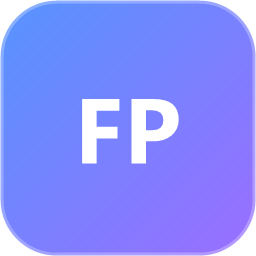

# 🎮 FramePulse

**Лёгкий игровой оверлей для Windows** — FPS, время кадра, ЦП, ГП, температура, память — прямо поверх игры.

<br>

<p align="center">
  
</p>

<p align="center">
  <b>Тёмный неон-стиль · Настоящая прозрачность · Русский интерфейс</b>
</p>

<p align="center">
  
  
  
  
</p>

---

## ✨ Возможности

| Функция | Описание |
|--------|----------|
| 🎯 **FPS и low 1%** | Живой счётчик кадров через **PresentMon** |
| ⏱ **Время кадра** | `ms` и `low1` в реальном времени |
| 🖥 **ЦП / ГП** | Полоски загрузки с цветовой индикацией |
| 🌡 **Температура** | Датчик NVIDIA через NVML (норма / тепло / жара) |
| 💾 **Память** | Видеопамять (ГП) и оперативная память (ОЗУ) |
| 🕐 **Часы** | Время `HH:mm` в углу панели |
| 🎛 **Настройки** | Окно настроек: строки, прозрачность, угол, монитор |
| 📌 **Полупрозрачность** | Настоящий alpha-оверлей (`UpdateLayeredWindow`) |
| 🖱 **Перетаскивание** | Свободное перемещение панели мышью |
| 📡 **PresentMon** | Захват кадров выбранного процесса (или активного окна) |

---

## 🖼 Интерфейс

```
┌────────────────────────────┐
│  144 FPS            18:42  │
│  6.9 ms   low1 12          │
│  ─────────────────────     │
│  ЦП   34%  ████████░░      │
│  ГП   71%  ██████████░     │
│  ТЕМП  72°C                │
│  ГП   5.2/8.0 GB           │
│  ОЗУ 12.4/31.9 GB          │
│  VALORANT-Win64-...        │
└────────────────────────────┘
```

---

## ⬇️ Установка

### Вариант 1 — Установщик (рекомендуется)

1. Скачайте **`FramePulse-Setup.exe`** из [Releases](../../releases)
2. Запустите установщик **от имени администратора**
3. При желании отметьте:
   - ярлык на рабочий стол
   - автозапуск с Windows
   - применение настроек по умолчанию
4. Нажмите **Установить** → **Завершить**

### Вариант 2 — Без установки

1. Скачайте архив из [Releases](../../releases)
2. Распакуйте и запустите `FramePulse.exe`

---

## 🎮 Управление

### Горячие клавиши

| Комбинация | Действие |
|-----------|----------|
| `Ctrl+Shift+F10` | Показать / скрыть оверлей |
| `Ctrl+Shift+F11` | Следующий монитор |
| `Ctrl+Shift+F12` | Режим перетаскивания |

### Меню в трее

| Пункт | Действие |
|-------|----------|
| ПКМ по иконке | Открыть меню |
| Двойной клик | Скрыть / показать оверлей |
| **Настройки…** | Окно настроек (живое применение) |
| **Свободное перемещение** | Перетаскивание панели |
| **Перезапустить PresentMon** | Переподключить захват кадров |
| **Закрыть** | Выход из приложения |

> 💡 В режиме перетаскивания нажми **Esc**, чтобы выйти.

---

## ⚙️ Настройки

Окно настроек применяется **в реальном времени**:

- **Отображение** — вкл/выкл FPS, времени кадра, ЦП, ГП, температуры, видеопамяти, ОЗУ
- **Прозрачность** — ползунок фона панели (50–255)
- **Позиция** — угол экрана или свободное положение
- **Монитор** — выбор дисплея
- **Процесс** — фильтр имени процесса (`пусто` = активное окно)

Конфигурация хранится в:

```
%APPDATA%\FpsOverlay\config.ini
```

---

## 🛠 Сборка из исходников

### Требования

- Windows 10/11
- [.NET Framework 4.8 Developer Pack](https://dotnet.microsoft.com/download/dotnet-framework/net48) (или `csc.exe` из Windows)
- [Inno Setup 6](https://jrsoftware.org/isinfo.php) — только для инсталлятора

### Сборка

```bat
cd fps-overlay
build.bat
```

Готовый файл: `dist\FramePulse.exe`

### Инсталлятор

```powershell
& "C:\Program Files (x86)\Inno Setup 6\ISCC.exe" installer.iss
```

Готовый файл: `..\installer\FramePulse-Setup.exe`

---

## 📁 Структура проекта

```
fps-overlay/
├── OverlayForm.cs        # Главное окно оверлея и отрисовка
├── SettingsForm.cs       # Окно настроек
├── Config.cs             # Чтение / запись config.ini
├── Native.cs             # WinAPI: UpdateLayeredWindow, хоткеи
├── PresentMonClient.cs   # Клиент PresentMon (захват FPS)
├── HardwareMonitor.cs    # ЦП, ГП, NVML, ОЗУ
├── Program.cs            # Точка входа
├── app.manifest          # DPI, requireAdministrator
├── build.bat             # Сборка exe
├── installer.iss         # Скрипт Inno Setup
├── make-icon.ps1         # Генерация иконки
├── icon.ico              # Иконка приложения
└── config.default.ini    # Настройки по умолчанию
```

---

## 📋 Технологии

- **C#** / .NET Framework 4.x
- **GDI+** — отрисовка панели
- **UpdateLayeredWindow** — per-pixel alpha
- **PresentMon** (Intel) — замер кадров
- **NVML** — датчики NVIDIA
- **Inno Setup** — установщик

---

## ⚠️ Примечания

- Приложение запускается **от имени администратора** (манифест) — нужно для глобальных хоткеев.
- Оверлей может не отображаться в играх с **эксклюзивным fullscreen** — используйте **оконный** или **безрамочный** режим.
- `PresentMon.exe` должен лежать рядом с `FramePulse.exe`.

---

## 📄 Лицензия

Распространяется по лицензии [MIT](LICENSE).

---

<p align="center">
  Сделано с ❤️ для геймеров · <b>FramePulse</b>
</p>
